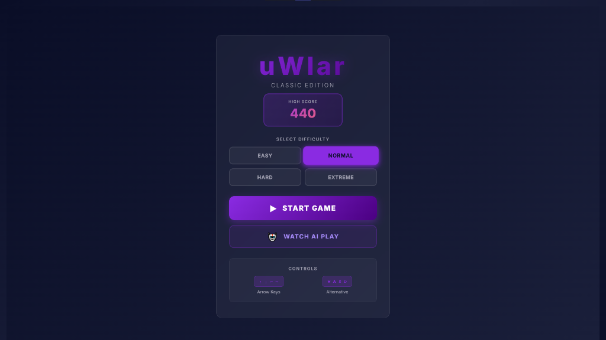
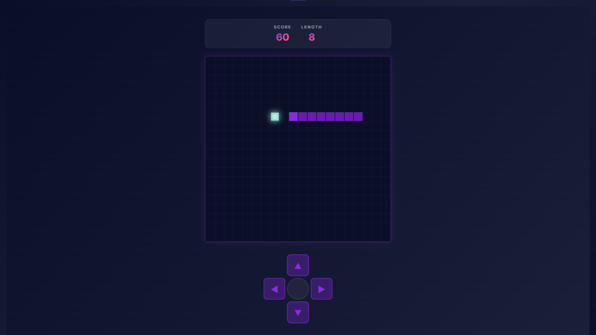
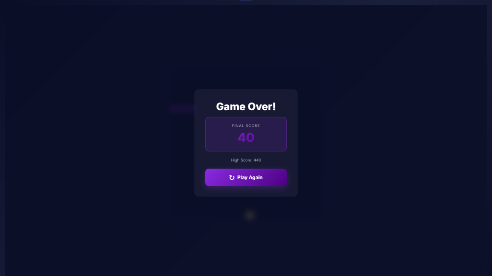

# uWlar: Classic Edition 🐍✨

**uWlar** is a modern, high-performance Snake game built with **React** and **Vite**. It features a stunning neon aesthetic, responsive controls, and a **Grandmaster-level AI** capable of playing the game perfectly.

<p align="center">
  
  
  
</p>


## 🌟 Features

*   **🤖 Grandmaster AI**: Watch the AI play! It uses advanced algorithms (BFS Pathfinding, Safety Checks, Longest Path Stalling, Panic Mode) to achieve scores of **3950+** on Extreme Mode (nearly filling the entire 20x20 grid).
*   **🎨 Neon Aesthetics**: Beautiful "Glassmorphism" UI, glowing food particles, and smooth animations using the Canvas API.
*   **⚡ Optimized Performance**:
    *   Rendering logic decoupled from React state using `requestAnimationFrame` for buttery smooth 60fps.
    *   Instant input response on mobile (0ms touch delay).
*   **📱 Fully Responsive**: Plays perfectly on Desktop (Keyboard) and Mobile (Touch D-Pad).

## 🛠️ Tech Stack

*   **React 18**
*   **Vite**
*   **HTML5 Canvas API**
*   **CSS3** (Variables, Flexbox, Glassmorphism)

## 🚀 Getting Started

1.  **Clone the repository:**
    ```bash
    git clone https://github.com/yourusername/uwlar-snake-ai.git
    cd uwlar-snake-ai
    ```

2.  **Install dependencies:**
    ```bash
    npm install
    ```

3.  **Run the game:**
    ```bash
    npm run dev
    ```

4.  **Build for production:**
    ```bash
    npm run build
    ```

## 🎮 How to Play

*   **Arrow Keys / WASD**: Move the snake.
*   **On-Screen D-Pad**: For mobile/touch control.
*   **Watch AI Play**: Sit back and learn from the master!

## 🧠 AI Strategy

The AI isn't just a simple pathfinder. It "thinks" before it moves:
1.  **Pathfinding**: Uses BFS to find the shortest path to food.
2.  **Safety Simulation**: "If I eat the food, can I still reach my tail?" If not, it aborts.
3.  **Survival Mode**: If no safe path to food exists, it follows its own tail to stall and wait for an opening.
4.  **Open Space Confidence**: If 90% of the board is open, it takes calculated risks to play aggressively.

---

Made with ❤️ by mhudas.
